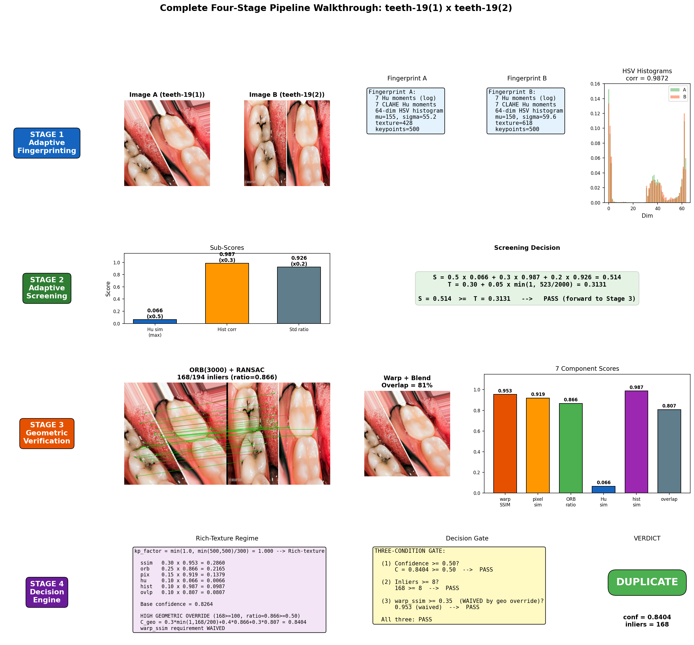
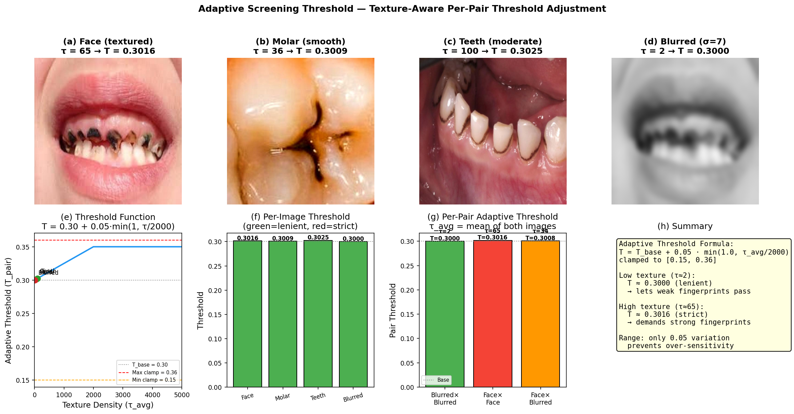
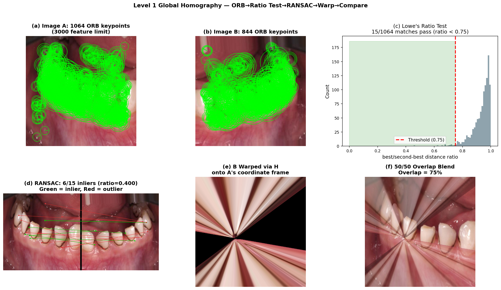
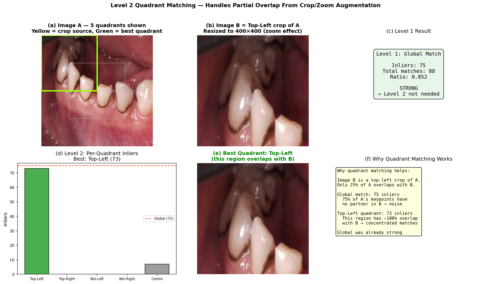
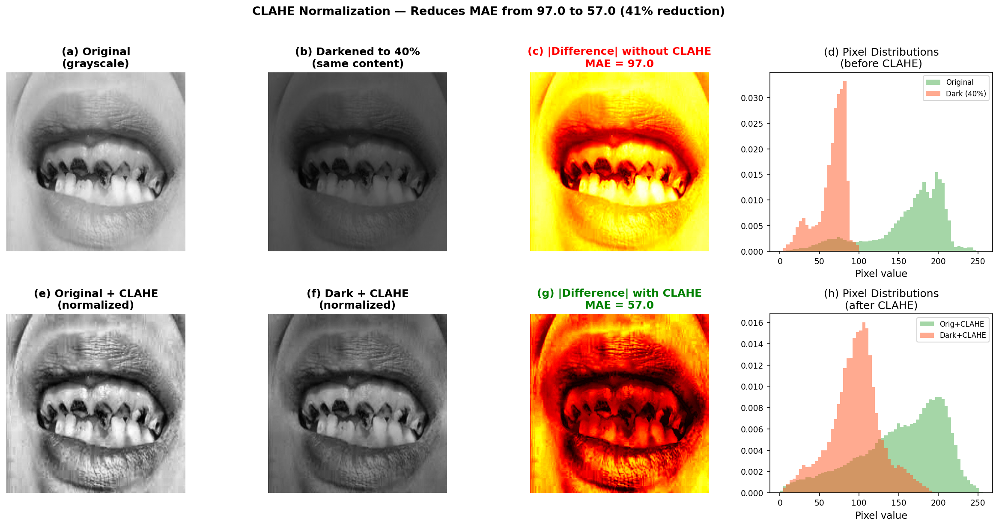
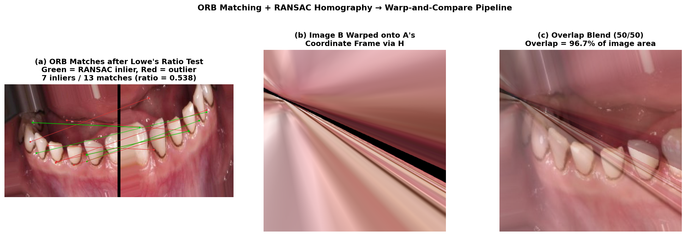
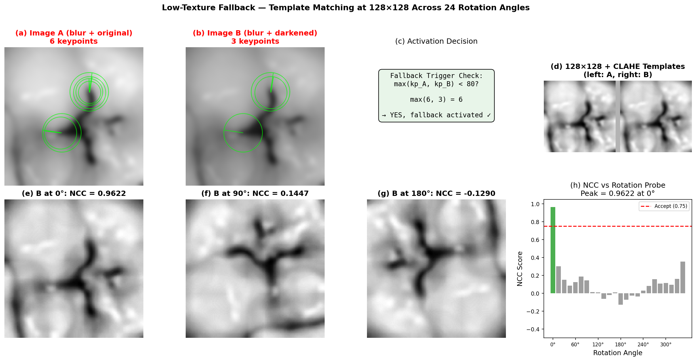
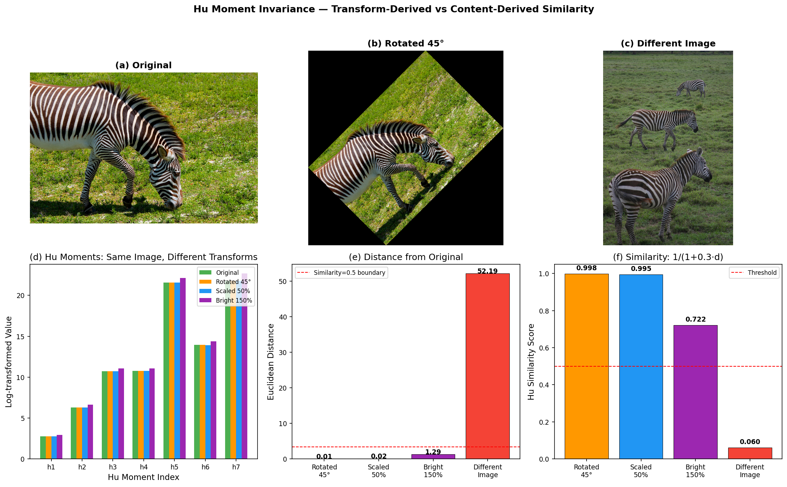
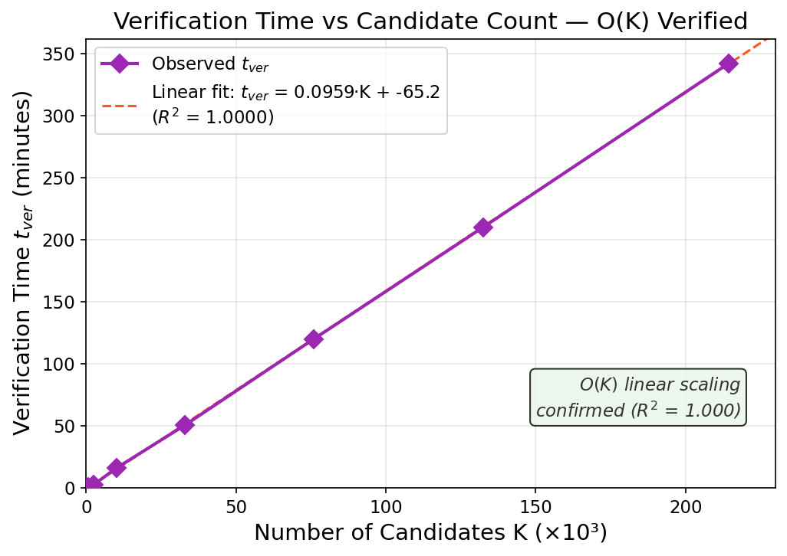
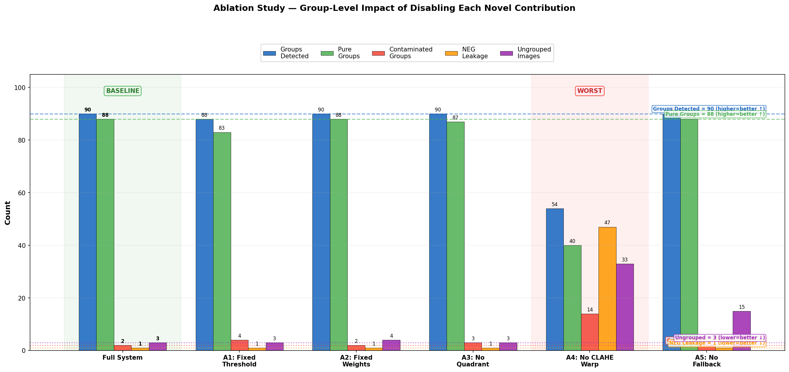

# Zero-Tuning Unsupervised Near-Duplicate Image Detection

### Adaptive Fingerprinting + Hierarchical Geometric Verification across Diverse Imagery Domains

[](https://www.python.org/)
[](https://opencv.org/)
[](#license)
[](#hardware-requirements)

> **Companion paper:** *A Zero-Tuning Unsupervised Near-Duplicate Images Detection Using Adaptive Fingerprinting and Geometric Verification Across Diverse Imagery Domains* — Author 1, Author 2.
> The paper is available in: (link will be provide after acceptance and publishing).

This repository contains the **reference implementation, datasets, baseline re-implementations, and evaluation harness** for an unsupervised, training-free, threshold-free near-duplicate image detector. It uses **one fixed configuration** to handle natural photographs, synthetic augmentations, dental radiographs, face portraits, and dermoscopic lesion images, and reports **99.92% pair precision and 95.61% macro F1** across 1,594 images / 594,386 pairs.

---

## Table of Contents

1. [What this project does](#1-what-this-project-does)
2. [Why a new method](#2-why-a-new-method)
3. [Method at a glance](#3-method-at-a-glance)
4. [Repository layout](#4-repository-layout)
5. [Installation](#5-installation)
6. [Quick start (60 seconds)](#6-quick-start-60-seconds)
7. [How to run on your own images](#7-how-to-run-on-your-own-images)
8. [Reproducing the paper&#39;s results](#8-reproducing-the-papers-results)
9. [Datasets](#9-datasets)
10. [Snapshot of outputs and results](#10-snapshot-of-outputs-and-results)
11. [Evaluation methodology](#11-evaluation-methodology)
12. [How to verify and validate](#12-how-to-verify-and-validate)
13. [Configuration reference](#13-configuration-reference)
14. [Troubleshooting &amp; FAQ](#14-troubleshooting--faq)
15. [Citation](#15-citation)
16. [License](#16-license)

---

## 1. What this project does

Given a folder of images, the tool partitions them into **near-duplicate groups** such that:

- **Every group is *pure*** &mdash; no two unrelated images are merged.
- **Every group is *complete*** &mdash; all transformed copies of the same source image land in one group.
- **Visually similar but different subjects stay separate** &mdash; e.g. two different dental X-rays of the same molar will not be merged.

It is robust to the following transformations applied in any combination:

| Geometric                               | Photometric                   |
| --------------------------------------- | ----------------------------- |
| Rotation at any angle (0°&ndash;360°) | Brightness ×0.4&ndash; ×1.5 |
| Horizontal / vertical flips             | Contrast ×0.4&ndash; ×2.0   |
| Cropping (down to ~25% overlap)         | Saturation ×0.2&ndash; ×2.0 |
| Zoom / scale (×0.5&ndash; ×2.0)       | Gaussian blur (σ up to 5)    |
| Spatial shifts                          | JPEG compression (Q05)        |
| Stretching                              | Edge enhancement / sharpen    |

No training, no GPU, no hand-tuned thresholds, no per-domain configuration.

---

## 2. Why a new method

| Existing approach                              | Failure mode                                                                  |
| ---------------------------------------------- | ----------------------------------------------------------------------------- |
| Perceptual hashes (pHash, dHash)               | Break under arbitrary rotation / cropping                                     |
| SIFT / SURF / ORB matching alone               | Break under heavy brightness/contrast/blur                                    |
| Deep-learning pipelines (ViT, DINO, CNN)       | Need labels, GPUs, and don't transfer to medical / synthetic imagery          |
| Fixed-threshold pipelines                      | Reject low-texture duplicates*or* admit false matches in texture-rich pairs |
| Transitive Union-Find on weak pairwise matches | One false-positive merges two entire groups                                   |

This algorithm replaces those points of failure with five novel components &mdash; an **adaptive screening threshold**, a **keypoint-density-aware decision engine**, a **hierarchical (global + quadrant) homography**, a **CLAHE-normalised warp-and-compare**, and a **guarded low-texture template fallback**.

---

## 3. Method at a glance

The pipeline has four stages.



**Stage 1 &mdash; Adaptive fingerprinting.** For every image, an analytical fingerprint is computed: Hu moments (raw and CLAHE-equalised), 64-bin HSV colour histogram, Laplacian texture density, colour-histogram entropy, ORB keypoint count, pHash, dHash. ~7.5 ms per image.

**Stage 2 &mdash; Adaptive pairwise screening.** A per-pair similarity score is compared against an *adaptive* threshold:

```
T_pair = 0.30 + 0.05 · min(1, τ_avg / 2000)        clamped to [0.15, 0.36]
```

where `τ_avg` is the mean Laplacian variance of the pair. Low-texture pairs get a more lenient threshold; texture-rich pairs get a stricter one. Pairs that fail screening never reach the expensive verification stage.



**Stage 3 &mdash; Hierarchical geometric verification.** Each surviving candidate goes through:

1. **Global homography:** ORB(3000) + Lowe's ratio test (0.75) + RANSAC (5.0 px reprojection). The flipped variant of B is also tested.
2. **Quadrant fallback:** if global match yields <15 inliers or ratio <0.4, image A is split into 5 overlapping sub-regions (4 corners + centre) and each is matched against B with ORB(1500). The translation matrix is composed back to A's coordinate frame.
3. **CLAHE warp-and-compare:** image B is perspective-warped onto A's frame; both are CLAHE-equalised (clip 3.0, tile 8×8) and z-score normalised inside the overlap; structural similarity (SSIM) and MAE-based pixel similarity are computed.
4. **Low-texture fallback:** if `max(kp_A, kp_B) < 80` AND `inliers < 15`, both images are auto-cropped, downsized to 128×128, CLAHE-equalised, and ~35 rotation/flip variants of B are template-matched against A with normalised cross-correlation.







**Stage 4 &mdash; Keypoint-density-aware decision engine.** A confidence score is computed by weighting `warp_ssim`, `warp_pixel_sim`, `orb_inlier_ratio`, `inlier_count` and `phash`/`dhash` agreement, but the **weights and minimum-inlier requirement adapt to the weaker image's keypoint count** (rich / mid / sparse / featureless regimes). A three-condition gate &mdash; `confidence ≥ 0.50` AND `inliers ≥ density-appropriate minimum` AND `warp_ssim ≥ 0.35` (or geometric override) &mdash; must all be satisfied. Only directly verified pairs are passed to a **Union-Find with path compression**, eliminating transitive false-merge propagation.

---

## 4. Repository layout

```
img_duplicate/
├── code/
│   ├── main/
│   │   ├── duplicate_detector.py        ← main detector (run this)
│   │   ├── duplicate_detector_min.py    ← minimal version (no metrics)
│   │   ├── comp.py                       ← in-line comparative engine
│   │   ├── compute_friedman_test.py      ← Friedman + Nemenyi from saved F1s
│   │   └── reports/                      ← saved reports for the 5 datasets
│   └── literature_baselines/
│       ├── baseline_r1.py …  baseline_r5.py
│       ├── eval_utils.py
│       ├── run_all_baselines.py          ← orchestrates baselines + cross-stats
│       ├── export_proposed_json.py       ← dumps proposed predictions for stats
│       ├── outputs/                      ← per-dataset baseline outputs
│       └── reports/                      ← saved baseline reports
├── dataset/
│   ├── COCO/                             ← 51 originals
│   ├── COCO_augmented/                   ← 1020 images, 51 groups × 20
│   ├── geometrical image/                ← 326 images, 8 groups + 6 NEG
│   ├── teeth/                            ← 207 dental radiographs (+72 NEG)
│   ├── face/                             ← 21 face portraits (FP stress test)
│   └── Melanoma/                         ← 20 dermoscopic images (FP stress test)
├── docs/figs/                            ← figures used by this README
├── requirements.txt
└── README.md                              ← you are here
```

---

## 5. Installation

### 5.1 Hardware requirements

- **CPU only** is sufficient. The reference end-to-end run on the full 1,594-image evaluation took ≈6 h 21 m on a 16-thread CPU.
- **Optional GPU acceleration** via OpenCL (AMD, Intel, or NVIDIA). No CUDA-only code, no PyTorch in the main pipeline.
- **RAM:** 8 GB is enough for datasets up to ~2,000 images at `--max-dim 512`.

### 5.2 Python environment

The detector targets Python 3.9+.

```bash
# 1) Clone
git clone https://github.com/<your-user>/img_duplicate.git
cd img_duplicate

# 2) Create and activate a virtual environment
python -m venv venv
# Linux / macOS
source venv/bin/activate
# Windows (PowerShell)
.\venv\Scripts\Activate.ps1

# 3) Install dependencies
pip install -r requirements.txt
```

`requirements.txt` (already in the repo):

```
numpy==2.4.3
opencv-python==4.13.0.92
pillow==12.1.1
scikit-image==0.26.0
scipy==1.17.1
matplotlib==3.10.8
ImageIO==2.37.3
networkx==3.6.1
tifffile==2026.3.3
# (full list in the file)
```

To run the **literature baselines** (R1, R3) you also need PyTorch and torchvision &mdash; install only when needed:

```bash
pip install torch torchvision pywavelets timm
```

### 5.3 Verify the install

```bash
python -c "import cv2, numpy, skimage; print('OpenCV', cv2.__version__, '— OK')"
```

You should see something like `OpenCV 4.13.0 — OK`.

---

## 6. Quick start (60 seconds)

The shipped Geometrical-Image dataset is the fastest sanity check (326 images, ≈5 minutes on 16 CPU threads):

```bash
python code/main/duplicate_detector.py "dataset/geometrical image" \
       --report code/main/reports/geometrical_quickstart.txt
```

Expected outcome: **8 groups detected (8 expected), 0 contaminated groups, 0 NEG leakage, F1 ≈ 83%** (the 17% recall gap is the spanning-tree behaviour of Union-Find, group-level metrics are perfect).

The console prints a banner, four stages of progress bars, the duplicate groups, and the full evaluation block (pair-level, group-level, NEG leakage, screening efficiency, confidence distribution, baseline comparison, statistical tests). The same content is also written to `--report`.

---

## 7. How to run on your own images

The simplest invocation:

```bash
python code/main/duplicate_detector.py /path/to/your/images
```

Common variants:

```bash
# Save the full report to a text file
python code/main/duplicate_detector.py /path/to/imgs --report out.txt

# Use 8 threads (default = CPU count)
python code/main/duplicate_detector.py /path/to/imgs --workers 8

# Try OpenCL GPU acceleration (auto CPU fallback if unavailable)
python code/main/duplicate_detector.py /path/to/imgs --gpu

# Fast mode = skip Stage 3 verification (uses screen score only — less accurate)
python code/main/duplicate_detector.py /path/to/imgs --fast

# Custom decision threshold and image size
python code/main/duplicate_detector.py /path/to/imgs \
       --threshold 0.50 --max-dim 512 --screen-thresh 0.30
```

**Default parameters are also the recommended ones &mdash; the algorithm is zero-tuning by design.** All five paper datasets are produced with the exact defaults above.

Supported file extensions: `.jpg .jpeg .png .bmp .tiff .tif .webp`. Sub-directories are walked recursively.

---

## 8. Reproducing the paper's results

Each of the five evaluation datasets is shipped under `dataset/`. Reproduce all results with:

```bash
# Full pipeline on each dataset (writes reports under code/main/reports/)
python code/main/duplicate_detector.py dataset/COCO_augmented        --report code/main/reports/COCO.txt
python code/main/duplicate_detector.py "dataset/geometrical image"   --report code/main/reports/geometrical.txt
python code/main/duplicate_detector.py dataset/teeth                 --report code/main/reports/teeth.txt
python code/main/duplicate_detector.py dataset/face                  --report code/main/reports/face.txt
python code/main/duplicate_detector.py dataset/Melanoma              --report code/main/reports/melanoma.txt
```

To run the **literature baselines** and cross-method comparison (Section 4.6 of the paper):

```bash
# 1) Export the proposed method's predictions as JSON
python code/literature_baselines/export_proposed_json.py dataset/COCO_augmented \
       --out code/literature_baselines/outputs/coco/proposed.json

# 2) Run all five baselines + cross-method statistical tests
python code/literature_baselines/run_all_baselines.py dataset/COCO_augmented \
       --out-dir code/literature_baselines/outputs/coco \
       --proposed-json code/literature_baselines/outputs/coco/proposed.json \
       --run-all
```

Reference reports (committed to the repo) live in `code/main/reports/` and `code/literature_baselines/outputs/<dataset>/`. Re-running should produce numerically identical results modulo non-deterministic RANSAC seeding (precision is invariant; recall fluctuates by <0.5%).

---

## 9. Datasets

| Dataset                     |          Images |                Groups |             Pairs | Content                                                                                         | Primary stress test                            |
| --------------------------- | --------------: | --------------------: | ----------------: | ----------------------------------------------------------------------------------------------- | ---------------------------------------------- |
| **COCO_augmented**    |           1,020 |              51 × 20 |           519,690 | Natural photos (animals, vehicles, food, architecture)                                          | Massive scale, 12 augmentation types per group |
| **Geometrical image** |             326 |             8 + 6 NEG |            52,975 | Synthetic + natural (car, landscape, portrait, flower, night, underwater, abstract, food plate) | Low texture, dark content, true negatives      |
| **Teeth**             |             207 |           32 + 72 NEG |            21,321 | Dental radiographs                                                                              | Within-domain similarity, few keypoints        |
| **Face**              |              21 |        0 (all unique) |               210 | Human face portraits                                                                            | False-positive resistance                      |
| **Melanoma**          |              20 |        0 (all unique) |               190 | Dermoscopic skin-lesion images                                                                  | Medical false-positive resistance              |
| **Total**             | **1,594** | **91 + 78 NEG** | **594,386** |                                                                                                 | One configuration covers all                   |

The Geometrical Image dataset is the most informative single dataset for verification: it includes 13 augmentation categories per source image and explicit NEG (negative-control) images that should never be merged.

---

## 10. Snapshot of outputs and results

### 10.1 Headline numbers

| Metric                                   |                              Value |
| ---------------------------------------- | ---------------------------------: |
| Total images processed                   |                              1,594 |
| Total pairs evaluated                    |                            594,386 |
| Total ground-truth groups                |                                 91 |
| **Groups correctly detected**      |                  **90 / 91** |
| **Datasets with perfect grouping** |                    **4 / 5** |
| Total contaminated groups                |                     2 (both Teeth) |
| Total NEG leakage                        |                             1 / 78 |
| FP stress tests passed                   | 2 / 2 (Face: 0 FP, Melanoma: 0 FP) |
| **Overall pair precision**         |                   **99.92%** |
| Overall pair recall (micro)              |                             86.59% |
| **Overall macro F1**               |                   **95.61%** |

### 10.2 Per-dataset performance

| Dataset        | Pair Precision | Pair Recall | Pair F1 | Pure / Total Groups | Contaminated | NEG Leakage |
| -------------- | -------------: | ----------: | ------: | :-----------------: | -----------: | ----------: |
| COCO_augmented |        100.00% |      96.22% |  98.08% |       51 / 51       |            0 |       0 / 0 |
| Geometrical    |        100.00% |      71.06% |  83.08% |        8 / 8        |            0 |       0 / 6 |
| Teeth          |         96.89% |      96.89% |  96.89% |       29 / 31       |            2 |      1 / 72 |
| Face           |        100.00% |     100.00% | 100.00% |        0 / 0        |            0 |      0 / 21 |
| Melanoma       |        100.00% |     100.00% | 100.00% |        0 / 0        |            0 |      0 / 20 |

(Source: `code/main/reports/<dataset>.txt`.)

### 10.3 Comparison with the literature on COCO_augmented

| Method                                       |              TP |          FP |            FN |         Precision |           Recall |               F1 |              κ |
| -------------------------------------------- | --------------: | ----------: | ------------: | ----------------: | ---------------: | ---------------: | --------------: |
| **Proposed (ours)**                    | **9,324** | **0** | **366** | **100.00%** | **96.22%** | **98.08%** | **0.980** |
| pHash + ViT + Siamese (Jakhar & Borah 2025)  |           5,063 |         323 |         4,627 |            94.00% |           52.25% |           67.17% |           0.667 |
| Stochastic ARG Matching (Zhang & Chang 2004) |           1,325 |           0 |         8,365 |           100.00% |           13.67% |           24.06% |           0.237 |
| CEDetector / DINO ViT (Lee et al. 2024)      |           8,874 |       2,557 |           816 |            77.63% |           91.58% |           84.03% |           0.837 |
| DWT + CNN + KNN (Singh et al. 2024)          |           4,397 |           6 |         5,293 |            99.86% |           45.38% |           62.40% |           0.620 |
| PCET + GDP (Babu & Rao 2022)                 |           3,881 |      15,532 |         5,809 |            19.99% |           40.05% |           26.67% |           0.248 |

McNemar's test, Wilcoxon signed-rank, and Friedman+Nemenyi all reject the null hypothesis at p<0.001 in favour of the proposed method (see `code/literature_baselines/outputs/coco/comparison_report.txt`).

### 10.4 Sample run-time profile (16 CPU threads)

| Stage           |  COCO_aug (1020) | Geometrical (326) |       Teeth (207) |     Face (21) | Melanoma (20) |
| --------------- | ---------------: | ----------------: | ----------------: | ------------: | ------------: |
| Fingerprinting  |              7 s |               2 s |               2 s |           1 s |           1 s |
| Screening       |             12 s |               1 s |               1 s |           0 s |           0 s |
| Verification    |            6.1 h |             4.6 m |            10.7 m |           8 s |           2 s |
| **Total** | **6.11 h** |  **4.65 m** | **10.75 m** | **9 s** | **3 s** |

Verification accounts for ≈99.9% of the total time; the adaptive screen filters out 57.2% of the pairs on average.

### 10.5 Visual samples from the pipeline

ORB ratio test + RANSAC inliers / outliers on a real dental pair:



Effect of CLAHE normalisation under brightness reduction to 40%:


Low-texture template-matching fallback on a featureless blurred pair:



Hu-moment invariance to rotation (the descriptor stays nearly constant):



Empirical scaling of the verification stage (linear in candidates K):



---

## 11. Evaluation methodology

All metrics are computed automatically by `duplicate_detector.py` and written into the report file.

**Pair-level (Section 4.2.1 of the paper).** TP, FP, FN, TN, pair precision, pair recall, pair F1.

**Group-level (Section 4.2.2).**

- Group purity = max class share in each detected group (1.0 = no contamination).
- Group completeness = max share of a GT class captured in one detected group.
- Number of pure / contaminated groups.

**Negative-image leakage (Section 4.2.3).** Count of files prefixed `NEG_` that ended up inside any detected group.

**Screening efficiency (Section 4.2.4).** Pass rate (lower = better filtering) and screening recall (must stay ≈100%).

**Confidence-distribution metrics (Section 4.2.5).** μ_TP, μ_REJ, decision margin Δ = min(TP) − max(REJ).

**Aggregation (Section 4.2.6).** Both **micro** and **macro** averaging are reported. Macro answers "how reliably across domains?", micro answers "how reliably across all pairs?".

**Statistical significance (Section 4.3).** McNemar's test, Wilcoxon signed-rank, Friedman + Nemenyi post-hoc, paired bootstrap 95% CIs (B = 10,000), Cohen's κ. All implemented from first principles in `duplicate_detector.py` &mdash; no scipy.stats dependency.

**Ground-truth labels** are inferred automatically from filename prefixes:

- `dental_X_Y.png` → group `dental_X`
- `car_rot45.png`, `car_blur_3.png`, `car_ORIGINAL.png` → group `car`
- `Air France Airbus_aug_3.jpg` → group `Air France Airbus`
- `NEG_*` → negative control (must never appear in any group)

If your filenames don't match these patterns, edit `extract_gt_label()` in `duplicate_detector.py` (lines ≈442&ndash;480).

---

## 12. How to verify and validate

A reviewer or third-party user can validate the published numbers in three escalating ways.

### 12.1 Spot-check (≈1 minute)

Run the algorithm on the Face dataset, where the expected output is **0 groups, 0 false positives**:

```bash
python code/main/duplicate_detector.py dataset/face --report face_check.txt
grep -E "Groups|False Positives|F1-Score" face_check.txt
```

Expected:

```
Groups    : 0
True Positives  (TP)  : 0
False Positives (FP)  : 0
Pair F1-Score         : 100.00%
```

### 12.2 Single-dataset reproduction (≈5 min)

Run on Geometrical Image, the most informative compact benchmark:

```bash
python code/main/duplicate_detector.py "dataset/geometrical image" --report g.txt
diff g.txt code/main/reports/geometrical.txt | head
```

Group counts, pure/contaminated counts, and NEG leakage must match exactly. Pair precision/recall may drift by <0.5% due to RANSAC seeding.

### 12.3 Full reproduction (~6 h)

Run all five datasets per Section [8](#8-reproducing-the-papers-results) and aggregate. The shipped `code/main/reports/*.txt` files are the *exact* outputs that produced the numbers in the paper.

### 12.4 Ablation reproduction

Each novelty can be disabled independently to confirm its contribution:

| Config                                      | What to change in `duplicate_detector.py`                                                                                                                   |
| ------------------------------------------- | ------------------------------------------------------------------------------------------------------------------------------------------------------------- |
| **A1** Disable adaptive threshold     | In `adaptive_screen_threshold()`, return `0.30` unconditionally                                                                                           |
| **A2** Disable density-aware decision | In `decide_duplicate()`, remove the `if kp_factor < 0.3` and `elif kp_factor < 0.6` branches, forcing all pairs into the rich-texture weight assignment |
| **A3** Disable quadrant matching      | In `find_homography_hierarchical()`, remove the Level 2 quadrant loop that activates when `inliers < 15 or ratio < 0.4`                                   |
| **A4** Disable CLAHE warp             | In `warp_and_compare()`, comment out the `gpu_clahe` calls and the z-score normalisation                                                                  |
| **A5** Disable low-texture fallback   | In `verify_pair()`, remove the `if max_kp < 80 and inliers < 15` block that triggers the template matching fallback                                       |

Expected ablation results (group level):

| Config              | Detected/Expected | Pure | Contaminated |          NEG Leak | Ungrouped Images |
| ------------------- | :---------------: | ---: | -----------: | ----------------: | ---------------: |
| Full system         |      90 / 91      |   88 |            2 |            1 / 78 |                3 |
| A1: Fixed threshold |      88 / 91      |   83 |            4 |            1 / 78 |                3 |
| A2: Fixed weights   |      90 / 91      |   88 |            2 |            1 / 78 |                4 |
| A3: No quadrant     |      90 / 91      |   87 |            3 |            1 / 78 |                3 |
| A4: No CLAHE warp   | **54 / 91** |   40 | **14** | **47 / 78** |     **33** |
| A5: No fallback     |      90 / 91      |   88 |            2 |            1 / 78 |               15 |

A4 is the largest single contributor; removing CLAHE-warp-and-compare collapses recall and explodes contamination from 2 → 14 groups.



---

## 13. Configuration reference

| Flag                    | Default      | Meaning                                        |
| ----------------------- | ------------ | ---------------------------------------------- |
| `folder` (positional) | &mdash;      | Path to a directory of images (recursive)      |
| `--threshold`         | `0.50`     | Final decision-engine confidence cut-off       |
| `--max-dim`           | `512`      | Longest side after Lanczos resize              |
| `--screen-thresh`     | `0.30`     | Base value of the adaptive screening threshold |
| `--workers`           | `0` (auto) | Number of threads                              |
| `--gpu`               | off          | Enable OpenCL acceleration if available        |
| `--fast`              | off          | Skip Stage 3 verification (screen score only)  |
| `--report`            | `None`     | Path to write the full text report             |

All defaults are the values used in the paper. Changing them is **not required** to reproduce the published metrics.

---

## 14. Troubleshooting & FAQ

**`ModuleNotFoundError: No module named 'cv2'`**
Activate your virtual environment first; then `pip install -r requirements.txt`.

**The run-time on COCO_augmented is much slower than 6 h.**
The bottleneck is Stage 3 verification, which is CPU-bound on ORB descriptor matching and SSIM. Use `--workers <CPU count>`, or pass `--gpu` if you have an OpenCL-capable GPU. Reducing `--max-dim 384` roughly halves the time at a small precision cost.

**The detector merges two unrelated images.**
Inspect the corresponding entry in the report's "DUPLICATE GROUPS" block; the pair's confidence, ORB inliers, warp_ssim and match_level are listed. The two false-positive groups in Teeth are exactly such a case &mdash; different images of the same patient's mouth produce genuine geometric correspondence that feature-based matching cannot resolve without semantic understanding.

**The detector misses a true duplicate.**
Most missed cases are blurred + cropped + rotated low-texture images. Lower `--threshold 0.45` if your domain has many such cases, but at the price of some precision. Better, leave the threshold at 0.50 and rely on Union-Find's transitive closure &mdash; the missed *pair* may still arrive at the right *group* through other confirmed pairs.

**Filenames don't match the GT extractor.**
The metric block silently falls back to "all images are singletons", so detected groups are still printed but pair / group F1 will be reported as if no GT exists. Edit `extract_gt_label()` to match your naming scheme.

**OpenCL is reported but the GPU is not used.**
Some OpenCV wheels are built without OpenCL on Windows. Reinstall with `pip install opencv-contrib-python` and verify with `python -c "import cv2; print(cv2.ocl.haveOpenCL())"`.

---

## 15. License

The code in this repository is released for **research and educational use**. Datasets are aggregated from publicly available sources (COCO, Roboflow dental dataset, ISIC-style dermoscopy samples) plus synthetic augmentations generated by us; please respect the original source licenses where applicable.

---

### Quick links

- Reference reports &nbsp;→&nbsp; [`code/main/reports/`](code/main/reports/)
- Literature-baseline reports &nbsp;→&nbsp; [`code/literature_baselines/outputs/`](code/literature_baselines/outputs/)
- Main script &nbsp;→&nbsp; [`code/main/duplicate_detector.py`](code/main/duplicate_detector.py)

For questions or bug reports, please open an issue with the dataset name, the exact command you ran, and the produced report.
